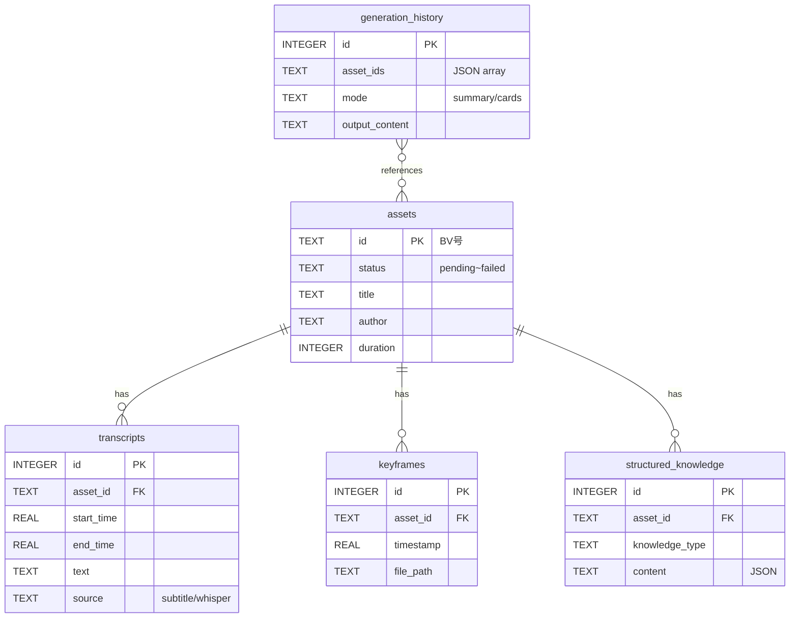
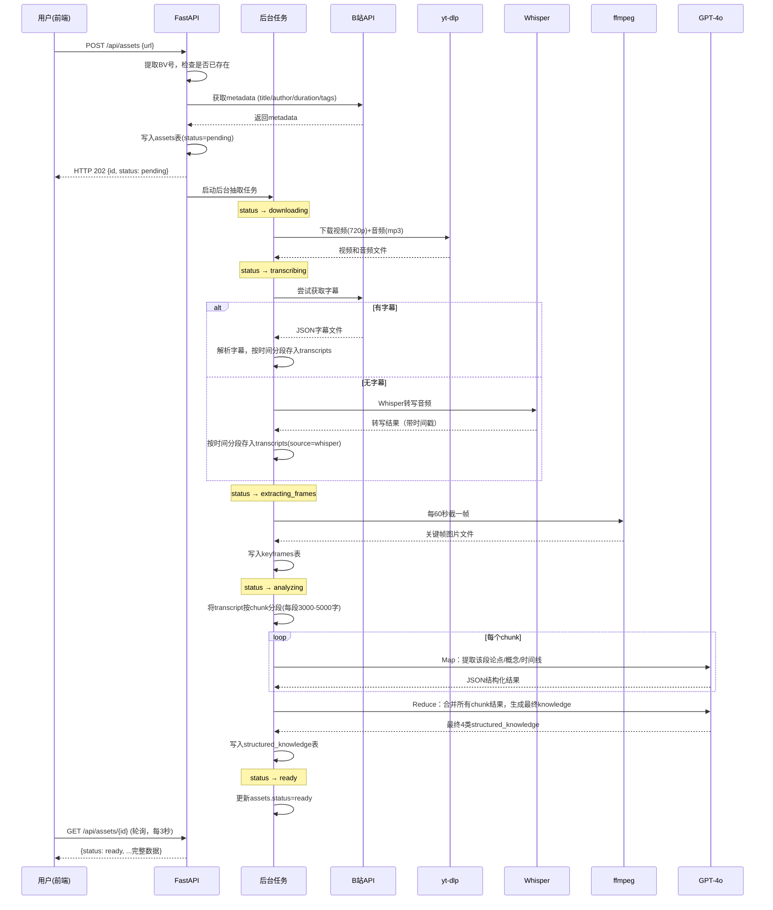
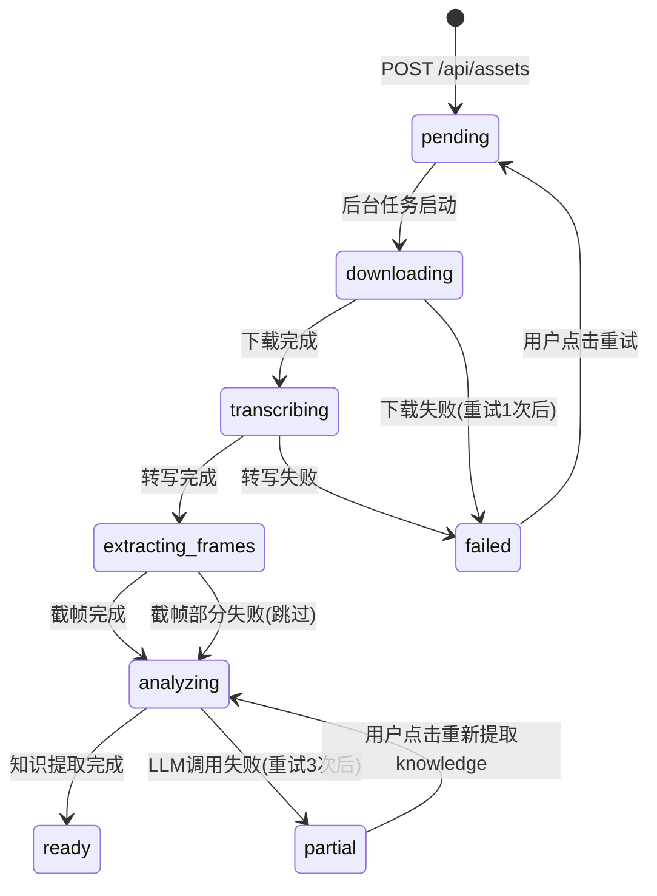

# BiliDigest — B站视频知识资产系统 PRD

> **本文档是项目的单一事实来源（Single Source of Truth）。**
> 每次开启新的开发会话时，请先读取本文档了解全局，再读取项目目录了解当前进度。

---

## 1. 产品概述

**一句话定义：** 输入B站视频URL，自动提取文本+视觉信息形成可复用的"知识资产"，支持基于资产进行查询、图文总结、知识卡片等多种输出生成。

**目标用户：** 经常看B站知识类/教程类长视频，但没时间反复观看，需要把视频内容沉淀为可检索、可复用知识库的重度学习者。

**核心价值：** 视频信息不再是"看完就忘"的一次性消费，而是变成可查询、可再生成、可跨视频融合的持久知识资产。

**与现有方案的差异：** 市面上的"AI视频总结"工具（如BibiGPT）只做一次性总结。本系统的差异是：①资产持久化可复用 ②包含视觉内容（关键帧）不仅仅是文本 ③支持多种输出模态和自定义prompt ④支持跨视频查询和融合。

---

## 2. 技术选型

| 层级 | 选型 | 理由 | 备选 |
|------|------|------|------|
| 前端框架 | Next.js 14 + React 18 | SSR+路由开箱即用，评审友好 | Vite+React |
| 前端样式 | TailwindCSS | 快速开发，无需写CSS文件 | shadcn/ui |
| 后端框架 | Python FastAPI | 异步支持好，自带Swagger，Python音视频生态成熟 | Flask |
| 数据库 | SQLite + FTS5 | 零配置，评审clone即跑，48h够用 | PostgreSQL |
| 视频下载 | yt-dlp (subprocess调用) | B站支持最完善，处理鉴权/CDN等复杂性 | you-get |
| 音频转写 | OpenAI Whisper (base模型) | 中文效果好，本地运行无额外费用 | faster-whisper |
| 关键帧截取 | ffmpeg (subprocess调用) | 行业标准，稳定可靠 | opencv |
| LLM | OpenAI GPT-4o（通过兼容接口） | 能力强，JSON输出稳定 | Claude API |
| Markdown渲染 | react-markdown + remark-gfm | 成熟稳定 | marked |

---

## 3. 项目结构

```
bilidigest/
├── frontend/                  # Next.js前端
│   ├── package.json
│   ├── next.config.js
│   ├── tailwind.config.js
│   ├── src/
│   │   ├── app/               # App Router页面
│   │   │   ├── page.tsx                    # 首页（URL输入+资产列表）
│   │   │   ├── assets/[id]/page.tsx        # 资产详情页
│   │   │   ├── generate/page.tsx           # 输出生成页
│   │   │   └── query/page.tsx              # 查询页
│   │   ├── components/        # React组件
│   │   │   ├── AssetCard.tsx               # 资产列表卡片
│   │   │   ├── UrlInput.tsx                # URL输入组件
│   │   │   ├── ProcessingStatus.tsx        # 处理进度展示
│   │   │   ├── TranscriptViewer.tsx        # 转写文本查看器
│   │   │   ├── KeyframeGallery.tsx         # 关键帧画廊
│   │   │   ├── KnowledgeDisplay.tsx        # 结构化知识展示
│   │   │   ├── SummaryRenderer.tsx         # 图文总结渲染
│   │   │   ├── KnowledgeCards.tsx          # 知识卡片组件
│   │   │   └── QueryPanel.tsx              # 查询面板
│   │   └── lib/
│   │       └── api.ts                      # 后端API调用封装
│   └── public/
├── backend/                   # FastAPI后端
│   ├── requirements.txt
│   ├── main.py                # FastAPI入口+路由注册
│   ├── config.py              # 配置（读.env）
│   ├── database.py            # SQLite初始化+表创建
│   ├── models.py              # Pydantic数据模型
│   ├── routers/
│   │   ├── assets.py          # /api/assets 路由
│   │   ├── generate.py        # /api/generate 路由
│   │   └── query.py           # /api/query 路由
│   ├── services/
│   │   ├── bilibili.py        # B站API+yt-dlp调用
│   │   ├── transcriber.py     # 字幕获取+Whisper转写
│   │   ├── keyframe.py        # ffmpeg关键帧截取
│   │   ├── knowledge.py       # LLM结构化知识提取(Map-Reduce)
│   │   └── generator.py       # 输出生成（总结/卡片/查询）
│   └── llm_client.py          # 统一LLM调用封装
├── data/                      # 运行时数据（gitignore）
│   ├── bilidigest.db          # SQLite数据库
│   └── assets/                # 视频资产文件
│       └── BVxxxxxxxxxx/
│           ├── video.mp4
│           ├── audio.mp3
│           └── keyframes/
│               ├── frame_0060.jpg
│               └── frame_0120.jpg
├── .env.example               # 环境变量模板
├── .gitignore
└── README.md
```

---

## 4. 数据模型

### 4.1 SQLite建表语句

以下SQL在应用首次启动时由 `backend/database.py` 自动执行：

```sql
-- 启用外键约束
PRAGMA foreign_keys = ON;

-- 资产主表
CREATE TABLE IF NOT EXISTS assets (
    id TEXT PRIMARY KEY,                          -- BV号，如 BV1GJ411x7h7
    url TEXT NOT NULL,                            -- 原始B站URL
    title TEXT DEFAULT '',                        -- 视频标题
    author TEXT DEFAULT '',                       -- UP主名称
    description TEXT DEFAULT '',                  -- 视频简介
    tags TEXT DEFAULT '[]',                       -- JSON数组，如 ["科技","编程"]
    duration INTEGER DEFAULT 0,                   -- 视频时长（秒）
    thumbnail_url TEXT DEFAULT '',                -- 封面图URL
    status TEXT DEFAULT 'pending'                 -- pending/downloading/transcribing/extracting_frames/analyzing/ready/partial/failed
        CHECK(status IN ('pending','downloading','transcribing','extracting_frames','analyzing','ready','partial','failed')),
    error_message TEXT,                           -- 失败时的错误描述
    created_at DATETIME DEFAULT CURRENT_TIMESTAMP,
    updated_at DATETIME DEFAULT CURRENT_TIMESTAMP
);

-- 转写文本表
CREATE TABLE IF NOT EXISTS transcripts (
    id INTEGER PRIMARY KEY AUTOINCREMENT,
    asset_id TEXT NOT NULL REFERENCES assets(id) ON DELETE CASCADE,
    start_time REAL NOT NULL,                     -- 开始时间（秒），如 63.5
    end_time REAL NOT NULL,                       -- 结束时间（秒），如 92.1
    text TEXT NOT NULL,                           -- 该段文本内容
    source TEXT NOT NULL DEFAULT 'subtitle'       -- subtitle / whisper
        CHECK(source IN ('subtitle','whisper'))
);
CREATE INDEX IF NOT EXISTS idx_transcripts_asset ON transcripts(asset_id);
CREATE INDEX IF NOT EXISTS idx_transcripts_time ON transcripts(asset_id, start_time);

-- 转写文本全文搜索索引（用于查询功能）
CREATE VIRTUAL TABLE IF NOT EXISTS transcripts_fts USING fts5(
    text,
    content='transcripts',
    content_rowid='id',
    tokenize='unicode61'
);

-- FTS同步触发器
CREATE TRIGGER IF NOT EXISTS transcripts_ai AFTER INSERT ON transcripts BEGIN
    INSERT INTO transcripts_fts(rowid, text) VALUES (new.id, new.text);
END;
CREATE TRIGGER IF NOT EXISTS transcripts_ad AFTER DELETE ON transcripts BEGIN
    INSERT INTO transcripts_fts(transcripts_fts, rowid, text) VALUES('delete', old.id, old.text);
END;
CREATE TRIGGER IF NOT EXISTS transcripts_au AFTER UPDATE ON transcripts BEGIN
    INSERT INTO transcripts_fts(transcripts_fts, rowid, text) VALUES('delete', old.id, old.text);
    INSERT INTO transcripts_fts(rowid, text) VALUES (new.id, new.text);
END;

-- 关键帧表
CREATE TABLE IF NOT EXISTS keyframes (
    id INTEGER PRIMARY KEY AUTOINCREMENT,
    asset_id TEXT NOT NULL REFERENCES assets(id) ON DELETE CASCADE,
    timestamp REAL NOT NULL,                      -- 截帧时间（秒）
    file_path TEXT NOT NULL,                      -- 相对路径，如 assets/BVxxx/keyframes/frame_0060.jpg
    ocr_text TEXT,                                -- OCR识别的文字（可选增强）
    description TEXT                              -- 画面描述（可选增强）
);
CREATE INDEX IF NOT EXISTS idx_keyframes_asset ON keyframes(asset_id);
CREATE INDEX IF NOT EXISTS idx_keyframes_time ON keyframes(asset_id, timestamp);

-- 结构化知识表
CREATE TABLE IF NOT EXISTS structured_knowledge (
    id INTEGER PRIMARY KEY AUTOINCREMENT,
    asset_id TEXT NOT NULL REFERENCES assets(id) ON DELETE CASCADE,
    knowledge_type TEXT NOT NULL                  -- arguments / timeline / concepts / conclusions
        CHECK(knowledge_type IN ('arguments','timeline','concepts','conclusions')),
    content TEXT NOT NULL,                        -- JSON字符串，schema见下方
    created_at DATETIME DEFAULT CURRENT_TIMESTAMP
);
CREATE INDEX IF NOT EXISTS idx_knowledge_asset ON structured_knowledge(asset_id);
CREATE INDEX IF NOT EXISTS idx_knowledge_type ON structured_knowledge(asset_id, knowledge_type);

-- 生成历史表
CREATE TABLE IF NOT EXISTS generation_history (
    id INTEGER PRIMARY KEY AUTOINCREMENT,
    asset_ids TEXT NOT NULL,                      -- JSON数组，如 ["BV1xxx","BV2xxx"]
    mode TEXT NOT NULL                            -- summary / cards
        CHECK(mode IN ('summary','cards')),
    user_prompt TEXT,                             -- 用户自定义prompt（可为空）
    output_content TEXT NOT NULL,                 -- 生成结果（Markdown或JSON字符串）
    created_at DATETIME DEFAULT CURRENT_TIMESTAMP
);
```

### 4.2 structured_knowledge JSON Schema

**arguments（核心论点）：**
```json
[
  {
    "text": "视频中的GPU并行计算效率比CPU高100倍",
    "time_ref": "03:20-04:15",
    "transcript_ids": [12, 13, 14],
    "confidence": "high"
  }
]
```

**timeline（内容时间线）：**
```json
[
  {
    "title": "GPU架构基础介绍",
    "start_time": 0,
    "end_time": 300,
    "summary": "讲解了GPU的基本架构，包括SM、CUDA核心等概念",
    "transcript_ids": [1, 2, 3, 4, 5]
  }
]
```

**concepts（关键概念）：**
```json
[
  {
    "name": "CUDA核心",
    "definition": "NVIDIA GPU中的基本计算单元，每个核心可以独立执行浮点运算",
    "first_mention_time": 180,
    "transcript_ids": [7]
  }
]
```

**conclusions（结论与建议）：**
```json
{
  "summary": "GPU编程是AI时代的核心技能，入门门槛正在降低",
  "action_items": [
    {
      "text": "建议从PyTorch开始学习GPU编程，而非直接学CUDA C",
      "transcript_ids": [45, 46]
    }
  ]
}
```

### 4.3 ER关系图



---

## 5. API接口定义

> 后端基础URL：`http://localhost:8000`
> 所有接口前缀：`/api`
> 关键帧图片静态文件路由：`/static/assets/{bv_id}/keyframes/{filename}`

### 5.1 资产管理

**创建资产（提交视频URL）**
```
POST /api/assets
```
请求体：
```json
{
  "url": "https://www.bilibili.com/video/BV1GJ411x7h7"
}
```
成功响应（HTTP 202 Accepted）：
```json
{
  "id": "BV1GJ411x7h7",
  "status": "pending",
  "message": "资产创建成功，正在后台处理"
}
```
重复提交响应（HTTP 200）：
```json
{
  "id": "BV1GJ411x7h7",
  "status": "ready",
  "message": "该视频已处理完成",
  "allow_reprocess": true
}
```
URL格式错误响应（HTTP 422）：
```json
{
  "detail": "无效的B站视频URL，请输入包含BV号的链接"
}
```

**重新处理资产**
```
POST /api/assets/{bv_id}/reprocess
```
成功响应（HTTP 202）：
```json
{
  "id": "BV1GJ411x7h7",
  "status": "pending",
  "message": "已触发重新处理"
}
```

**获取资产列表**
```
GET /api/assets
```
响应（HTTP 200）：
```json
{
  "assets": [
    {
      "id": "BV1GJ411x7h7",
      "title": "【GPU编程】从零开始学CUDA",
      "author": "技术UP主",
      "duration": 1800,
      "thumbnail_url": "https://i0.hdslb.com/bfs/archive/xxx.jpg",
      "status": "ready",
      "created_at": "2025-01-15T10:30:00",
      "transcript_count": 30,
      "keyframe_count": 30,
      "knowledge_count": 4
    }
  ]
}
```

**获取单个资产详情**
```
GET /api/assets/{bv_id}
```
响应（HTTP 200）：
```json
{
  "id": "BV1GJ411x7h7",
  "url": "https://www.bilibili.com/video/BV1GJ411x7h7",
  "title": "【GPU编程】从零开始学CUDA",
  "author": "技术UP主",
  "description": "本期视频详细讲解...",
  "tags": ["科技", "编程", "GPU"],
  "duration": 1800,
  "thumbnail_url": "https://i0.hdslb.com/bfs/archive/xxx.jpg",
  "status": "ready",
  "error_message": null,
  "created_at": "2025-01-15T10:30:00",
  "updated_at": "2025-01-15T10:45:00",
  "transcripts": [
    {
      "id": 1,
      "start_time": 0.0,
      "end_time": 28.5,
      "text": "大家好，今天我们来聊聊GPU编程...",
      "source": "subtitle"
    }
  ],
  "keyframes": [
    {
      "id": 1,
      "timestamp": 60.0,
      "file_path": "assets/BV1GJ411x7h7/keyframes/frame_0060.jpg",
      "url": "/static/assets/BV1GJ411x7h7/keyframes/frame_0060.jpg",
      "ocr_text": null,
      "description": null
    }
  ],
  "structured_knowledge": {
    "arguments": [...],
    "timeline": [...],
    "concepts": [...],
    "conclusions": {...}
  }
}
```

**删除资产**
```
DELETE /api/assets/{bv_id}
```
响应（HTTP 200）：
```json
{
  "message": "资产已删除",
  "id": "BV1GJ411x7h7"
}
```

### 5.2 输出生成

**生成输出**
```
POST /api/generate
```
请求体：
```json
{
  "asset_ids": ["BV1GJ411x7h7"],
  "mode": "summary",
  "user_prompt": "侧重可行动的建议"
}
```
`mode` 可选值：`summary`（图文总结） / `cards`（知识卡片）
`user_prompt` 可选，为空则使用默认模板。

**summary模式响应（HTTP 200）：**
```json
{
  "mode": "summary",
  "content": "## 核心要点\n\n本视频详细讲解了GPU编程的基础知识...\n\n\n\n### 1. GPU架构基础 [00:00-05:00]\n\n...",
  "references": [
    {
      "asset_id": "BV1GJ411x7h7",
      "asset_title": "【GPU编程】从零开始学CUDA",
      "time_refs": ["00:00-05:00", "05:00-12:30", "25:00-28:00"]
    }
  ],
  "generation_id": 1
}
```

**cards模式响应（HTTP 200）：**
```json
{
  "mode": "cards",
  "content": [
    {
      "title": "GPU vs CPU：并行计算的本质差异",
      "content": "GPU拥有数千个小核心，适合大规模并行计算任务。与CPU的几个强核心不同，GPU的设计理念是...",
      "keyframe_url": "/static/assets/BV1GJ411x7h7/keyframes/frame_0060.jpg",
      "time_ref": "02:30-05:00",
      "asset_id": "BV1GJ411x7h7"
    }
  ],
  "references": [...],
  "generation_id": 2
}
```

### 5.3 查询

**基于资产查询**
```
POST /api/query
```
请求体：
```json
{
  "asset_ids": ["BV1GJ411x7h7"],
  "question": "视频里推荐了哪些学习GPU编程的资源？"
}
```
响应（HTTP 200）：
```json
{
  "answer": "视频中推荐了以下学习资源：\n\n1. NVIDIA官方CUDA Toolkit文档...\n2. PyTorch官方教程的GPU部分...",
  "references": [
    {
      "asset_id": "BV1GJ411x7h7",
      "asset_title": "【GPU编程】从零开始学CUDA",
      "transcript_id": 45,
      "start_time": 1500.0,
      "end_time": 1560.0,
      "text": "我个人最推荐的学习路径是先从PyTorch开始..."
    }
  ]
}
```

### 5.4 生成历史

**获取生成历史**
```
GET /api/history?asset_id=BV1GJ411x7h7
```
响应（HTTP 200）：
```json
{
  "history": [
    {
      "id": 1,
      "asset_ids": ["BV1GJ411x7h7"],
      "mode": "summary",
      "user_prompt": "侧重可行动的建议",
      "created_at": "2025-01-15T11:00:00",
      "preview": "## 核心要点\n\n本视频详细讲解了..."
    }
  ]
}
```

---

## 6. 核心流程

### 6.1 资产创建与抽取流程（异步）



### 6.2 资产状态机



状态含义：
- `pending`：已创建，等待处理
- `downloading`：正在下载视频/音频
- `transcribing`：正在获取字幕/转写
- `extracting_frames`：正在截取关键帧
- `analyzing`：正在调用LLM提取结构化知识
- `ready`：全部完成
- `partial`：transcript+keyframes完成，但knowledge提取失败
- `failed`：核心步骤失败（下载/转写），无法继续

### 6.3 长文本Map-Reduce处理流程

```
输入：transcript全文（可能3万字+）

判断：总字数 < 5000？
  ├─ 是 → 直接一次性送入LLM提取4类knowledge
  └─ 否 → Map-Reduce流程：
          1. 按时间顺序分chunk，每chunk约3000-5000字
             分割点选在transcript记录的边界（不切断单条record）
          2. Map阶段：对每个chunk并行调用LLM
             输入：chunk文本 + chunk内的transcript_ids
             输出：该chunk的arguments/concepts/timeline片段
          3. Reduce阶段：将所有Map结果合并
             输入：所有chunk的提取结果
             输出：去重合并后的最终4类knowledge
             要求：保持transcript_ids的正确关联
```

---

## 7. 关键工程实现细节

### 7.1 ⚠️ 视频下载（yt-dlp）

B站 `playurl` 接口需要Cookie/SESSDATA/Wbi签名，裸调会403。**必须使用yt-dlp。**

```python
# backend/services/bilibili.py 中的下载逻辑示意

import subprocess
import os

def download_video(bv_id: str, url: str, output_dir: str):
    """下载视频文件用于截帧"""
    video_path = os.path.join(output_dir, "video.mp4")
    cmd = [
        "yt-dlp",
        "-f", "bestvideo[height<=720]+bestaudio/best[height<=720]",
        "--merge-output-format", "mp4",
        "-o", video_path,
        "--no-playlist",
        url
    ]
    result = subprocess.run(cmd, capture_output=True, text=True, timeout=300)
    if result.returncode != 0:
        raise Exception(f"yt-dlp下载失败: {result.stderr}")
    return video_path

def download_audio(bv_id: str, url: str, output_dir: str):
    """下载音频文件用于转写"""
    audio_path = os.path.join(output_dir, "audio.mp3")
    cmd = [
        "yt-dlp",
        "-x", "--audio-format", "mp3",
        "-o", audio_path,
        "--no-playlist",
        url
    ]
    result = subprocess.run(cmd, capture_output=True, text=True, timeout=300)
    if result.returncode != 0:
        raise Exception(f"yt-dlp音频下载失败: {result.stderr}")
    return audio_path
```

### 7.2 ⚠️ B站字幕获取

```python
# 步骤1：获取cid
# GET https://api.bilibili.com/x/web-interface/view?bvid=BV1GJ411x7h7
# 从response.data.cid获取

# 步骤2：获取字幕URL
# GET https://api.bilibili.com/x/player/v2?bvid=BV1GJ411x7h7&cid={cid}
# 从response.data.subtitle.subtitles数组中获取字幕URL（通常是JSON格式）

# 步骤3：下载字幕JSON
# 字幕URL格式通常为 https://i0.hdslb.com/bfs/ai_subtitle/...
# 需要加https:前缀（返回的URL可能没有协议头）
# JSON结构：{ "body": [{ "from": 0.0, "to": 5.2, "content": "文字" }] }
```

### 7.3 ⚠️ 关键帧截取（ffmpeg）

```bash
# 每60秒截一帧
ffmpeg -i video.mp4 -vf "fps=1/60,scale=1280:-1" -q:v 3 keyframes/frame_%04d.jpg

# 参数说明：
# fps=1/60 → 每60秒取1帧
# scale=1280:-1 → 宽度1280，高度按比例
# -q:v 3 → JPEG质量（2-5，越小越好）
```

截帧后需要计算每张图片的实际时间戳：
```python
# frame_0001.jpg → 60秒, frame_0002.jpg → 120秒, ...
timestamp = frame_index * 60  # frame_index从1开始
```

### 7.4 ⚠️ LLM调用封装

```python
# backend/llm_client.py
import os
import json
import httpx

class LLMClient:
    def __init__(self):
        self.api_key = os.getenv("LLM_API_KEY")
        self.base_url = os.getenv("LLM_BASE_URL", "https://api.openai.com/v1")
        self.model = os.getenv("LLM_MODEL", "gpt-4o")
        self.timeout = 60
        self.max_retries = 3

    async def chat(self, system_prompt: str, user_prompt: str) -> str:
        """发送聊天请求，返回文本响应"""
        # 实现重试逻辑、超时处理
        ...

    async def chat_json(self, system_prompt: str, user_prompt: str) -> dict:
        """发送请求并解析JSON响应，含容错处理"""
        text = await self.chat(system_prompt, user_prompt)
        return self._parse_json(text)

    def _parse_json(self, text: str) -> dict:
        """JSON解析容错：去除markdown代码块标记、修复常见错误"""
        # 去除 ```json ... ``` 包裹
        text = text.strip()
        if text.startswith("```"):
            text = text.split("\n", 1)[1]
        if text.endswith("```"):
            text = text.rsplit("```", 1)[0]
        return json.loads(text.strip())
```

### 7.5 异步任务实现

```python
# backend/routers/assets.py
from fastapi import BackgroundTasks

@router.post("/api/assets", status_code=202)
async def create_asset(req: CreateAssetRequest, bg: BackgroundTasks):
    bv_id = extract_bv_id(req.url)  # 从URL提取BV号

    # 检查是否已存在
    existing = db.get_asset(bv_id)
    if existing and existing.status == "ready":
        return {"id": bv_id, "status": "ready", "message": "该视频已处理完成", "allow_reprocess": True}

    # 获取metadata并创建资产记录
    metadata = await bilibili.get_metadata(bv_id)
    db.create_or_update_asset(bv_id, metadata, status="pending")

    # 启动后台任务
    bg.add_task(process_asset, bv_id, req.url)

    return {"id": bv_id, "status": "pending", "message": "资产创建成功，正在后台处理"}

async def process_asset(bv_id: str, url: str):
    """后台抽取全流程，每一步更新status"""
    try:
        db.update_status(bv_id, "downloading")
        video_path, audio_path = await download(bv_id, url)

        db.update_status(bv_id, "transcribing")
        transcripts = await transcribe(bv_id, audio_path)

        db.update_status(bv_id, "extracting_frames")
        keyframes = await extract_keyframes(bv_id, video_path)

        db.update_status(bv_id, "analyzing")
        knowledge = await extract_knowledge(bv_id, transcripts, keyframes)
        db.update_status(bv_id, "ready")

    except KnowledgeExtractionError:
        # LLM失败→partial（transcript和keyframes已保存）
        db.update_status(bv_id, "partial", error="知识提取失败，可重试")
    except Exception as e:
        db.update_status(bv_id, "failed", error=str(e))
```

---

## 8. 前端页面设计

### 8.1 首页（资产列表 + URL输入）

**路由：** `/`

**核心元素：**
- 顶部：项目Logo + 标题 "BiliDigest"
- URL输入区：输入框（placeholder: "粘贴B站视频链接..."） + 提交按钮
  - 前端正则校验：必须包含 `BV[a-zA-Z0-9]{10}` 格式
  - 校验失败时输入框显示红色边框 + 错误提示
- 资产列表：卡片网格（2-3列）
  - 每张卡片：封面缩略图 + 标题 + UP主 + 时长 + 状态标签
  - 状态标签颜色：ready=绿色, processing系列=蓝色+动画, partial=黄色, failed=红色
  - 点击卡片 → 跳转到资产详情页 `/assets/{bv_id}`
- 空状态：列表为空时显示引导文案

### 8.2 资产详情页

**路由：** `/assets/{bv_id}`

**核心元素：**
- 顶部：视频标题 + UP主 + 时长 + 状态 + 标签
- Tab导航：转写文本 | 关键帧 | 知识结构 | 生成输出 | 查询
- 转写文本Tab：
  - 按时间戳分段展示，每段前标注时间 `[00:00-00:28]`
  - source=whisper的段落标注"AI转写"标签
- 关键帧Tab：
  - 缩略图网格，点击可放大
  - 每张图下方标注时间戳
- 知识结构Tab：
  - 分4个折叠区：核心论点 / 时间线 / 关键概念 / 结论建议
  - 每条knowledge旁标注时间引用，可点击跳转到转写文本对应段
- 生成输出Tab：
  - 模态选择：图文总结 / 知识卡片（radio或tab切换）
  - prompt输入框（可选）
  - 生成按钮 → 生成中显示loading → 结果展示
  - 图文总结：Markdown渲染（react-markdown），图片内联显示
  - 知识卡片：卡片网格/列表，每张卡含图+文+时间引用
- 查询Tab：
  - 问题输入框 + 提交按钮
  - 回答展示区：答案文本 + 引用来源列表
- 特殊状态处理：
  - processing中：显示当前步骤进度（"正在下载视频..." 等）
  - partial：转写和关键帧正常展示，知识结构区显示"提取失败，点击重试"
  - failed：显示错误原因 + 重试按钮

### 8.3 前端轮询逻辑

```typescript
// frontend/src/lib/api.ts
export function useAssetPolling(bvId: string) {
  // 每3秒轮询一次 GET /api/assets/{bvId}
  // 当status变为ready/partial/failed时停止轮询
  // 返回最新的asset数据
}
```

---

## 9. 异常降级策略

| 场景 | 检测方式 | 降级方案 | 用户感知 |
|------|----------|----------|----------|
| URL格式错误 | 前端正则 `/BV[a-zA-Z0-9]{10}/` | 不发请求 | 输入框红框+错误文字 |
| 视频不存在 | B站API返回error | 标记failed | "该视频不存在或已被删除" |
| 需要大会员/付费 | yt-dlp报权限错误 | 标记failed | "该视频需要登录/付费，暂不支持" |
| 无字幕 | 字幕API返回空数组 | Whisper转写 | 资产详情标注"AI转写" |
| yt-dlp下载失败 | subprocess非0 | 重试1次→failed | 错误原因+重试按钮 |
| ffmpeg截帧失败 | subprocess非0 | 跳过失败帧 | 关键帧可能少于预期 |
| 视频超长(>4h) | 检查duration | 只处理前2h | 提示"已处理前2小时" |
| LLM调用失败 | API异常/超时 | 重试3次→partial | "知识提取失败，可重试" |
| LLM返回非法JSON | json.loads失败 | 尝试修复→重试1次 | 若仍失败→partial |
| 磁盘空间不足 | 下载前检查可用空间 | 拒绝处理 | "存储空间不足" |
| 后端重启 | 启动时扫描status | processing/downloading→failed | 用户可重试 |

---

## 10. 环境变量配置

`.env.example` 内容：
```bash
# === LLM配置 ===
LLM_API_KEY=sk-your-api-key-here
LLM_BASE_URL=https://api.openai.com/v1
LLM_MODEL=gpt-4o

# === 应用配置 ===
DATA_DIR=./data
MAX_VIDEO_DURATION=14400     # 最大处理时长（秒），默认4小时
MAX_PROCESS_DURATION=7200    # 超长视频只处理前N秒，默认2小时

# === 开发配置 ===
BACKEND_PORT=8000
FRONTEND_PORT=3000
DEBUG=true
```

---

## 11. 启动命令

```bash
# 环境要求：Python≥3.10, Node≥18, ffmpeg, yt-dlp

# 1. 克隆项目
git clone <repo-url> && cd bilidigest

# 2. 后端启动
cd backend
pip install -r requirements.txt
cp .env.example .env  # 然后编辑.env填入API Key
uvicorn main:app --host 0.0.0.0 --port 8000 --reload

# 3. 前端启动（新终端）
cd frontend
npm install
npm run dev

# 4. 访问
# 前端：http://localhost:3000
# 后端API文档：http://localhost:8000/docs
```

---

## 12. 开发阶段与验收标准

### 阶段一（0-6h）：脚手架 + 最小数据流

**任务清单：**
| Task | 预估 | 优先级 |
|------|------|--------|
| 初始化Next.js + TailwindCSS项目 | 0.5h | P0 |
| 初始化FastAPI项目 + 项目结构 | 0.5h | P0 |
| database.py：SQLite初始化+全部建表语句 | 1h | P0 |
| bilibili.py：metadata获取（B站API） | 1h | P0 |
| assets路由：POST+GET | 1.5h | P0 |
| 前端首页：URL输入+资产列表 | 1h | P0 |
| 前后端联调 | 0.5h | P0 |

**验收checklist：**
- [ ] `POST /api/assets` 传入真实B站URL → 返回含title/author/duration的JSON
- [ ] `GET /api/assets` 返回资产列表数组
- [ ] `GET /api/assets/{bv_id}` 返回单个资产详情
- [ ] SQLite数据库文件自动创建，assets表有记录
- [ ] 前端localhost:3000可访问，输入URL点击提交后页面显示视频标题
- [ ] 后端localhost:8000/docs可访问Swagger文档

### 阶段二（6-18h）：核心抽取链路

**任务清单：**
| Task | 预估 | 优先级 |
|------|------|--------|
| bilibili.py：yt-dlp下载视频+音频 | 2h | P0 |
| transcriber.py：字幕获取+Whisper降级 | 3.5h | P0 |
| keyframe.py：ffmpeg截帧 | 1.5h | P0 |
| llm_client.py：统一LLM封装 | 1h | P0 |
| knowledge.py：Map-Reduce知识提取 | 2.5h | P0 |
| assets路由：异步任务+状态更新 | 1.5h | P0 |

**验收checklist：**
- [ ] 有字幕视频：transcripts表有≥10条记录（10分钟视频），source="subtitle"
- [ ] 无字幕视频：Whisper转写成功，transcripts表有记录，source="whisper"
- [ ] `data/assets/{BV号}/keyframes/` 下有截图，数量≈时长÷60
- [ ] structured_knowledge表有4种类型记录，每条content可json.loads解析
- [ ] `POST /api/assets` 3秒内返回202，不阻塞
- [ ] 轮询 `GET /api/assets/{id}` 能看到status从pending逐步变为ready
- [ ] 任一步骤异常不导致后端进程崩溃

### 阶段三（18-30h）：输出 + 查询 + 前端

**任务清单：**
| Task | 预估 | 优先级 |
|------|------|--------|
| generator.py：图文总结生成 | 2h | P0 |
| generator.py：知识卡片生成 | 2h | P0 |
| query路由 + FTS5检索 + LLM回答 | 2h | P0 |
| 前端：资产列表页（卡片+状态） | 1.5h | P0 |
| 前端：资产详情页（5个Tab） | 2h | P0 |
| 前端：总结渲染+卡片渲染 | 2h | P0 |
| 前端：查询面板 | 1.5h | P0 |

**验收checklist：**
- [ ] `POST /api/generate` mode=summary → Markdown字符串含≥3张图片引用
- [ ] `POST /api/generate` mode=cards → JSON数组含5-15张卡片，每张有keyframe_url
- [ ] `POST /api/query` → 回答+references，引用的transcript_id真实存在
- [ ] 前端列表页：卡片显示标题+状态标签，颜色正确
- [ ] 前端详情页：5个Tab切换正常，transcript/keyframes/knowledge有内容
- [ ] 前端：图文总结Markdown渲染正确，图片可见
- [ ] 前端：知识卡片网格显示，每张卡有图有文
- [ ] 前端：查询输入问题后，显示回答和引用来源
- [ ] **完整流程可走通：** 粘贴URL → 等待处理 → 查看详情 → 生成总结/卡片 → 查询

### 阶段四（30-40h）：打磨 + 增强

**任务清单：**
| Task | 预估 | 优先级 |
|------|------|--------|
| 多资产选择+合并生成 | 2h | P1 |
| 用户自然语言prompt | 1h | P1 |
| 处理进度UI（显示当前步骤） | 1.5h | P1 |
| 错误处理+降级UI（failed/partial状态） | 1.5h | P1 |
| 响应式布局（手机适配） | 1h | P1 |
| 生成历史保存与展示 | 1.5h | P2 |
| 流式输出SSE（可选） | 1.5h | P2 |

**验收checklist：**
- [ ] 选≥2个资产生成总结，内容覆盖所有视频
- [ ] prompt输入框输入内容后，生成结果与默认有可辨识差异
- [ ] 处理中显示当前步骤文字（如"正在转写音频..."），有loading动画
- [ ] failed状态显示错误原因+重试按钮
- [ ] 手机宽度(375px)无严重布局问题

### 阶段五（40-48h）：收尾

**任务清单：**
| Task | 预估 | 优先级 |
|------|------|--------|
| README.md撰写 | 2h | P0 |
| .env.example确认+启动文档 | 0.5h | P0 |
| 代码清理 | 1h | P1 |
| 2个不同视频完整流程测试 | 1.5h | P0 |
| Demo录屏（可选，≤3分钟） | 1h | P1 |
| 最终Git提交 | 0.5h | P0 |
| Buffer | 1.5h | - |

**验收checklist：**
- [ ] README含：简介、快速启动(≤5步)、环境要求、技术选型、取舍说明、降级策略、未来迭代
- [ ] 全新环境按README操作能跑起来
- [ ] 代码无硬编码API Key，.env.example完整
- [ ] .gitignore排除 node_modules、__pycache__、data/、.env
- [ ] 至少2个不同B站视频完整测试通过

---

## 13. 砍减策略（按优先级，先砍前面的）

| 优先级 | 砍掉什么 | 影响 |
|--------|----------|------|
| 1 | 生成历史保存 | 每次重新生成，不影响核心功能 |
| 2 | 流式输出SSE | 改为一次性返回，等待时间略长 |
| 3 | OCR关键帧文字 | 不影响主流程 |
| 4 | 多资产合并生成 | 只支持单视频生成 |
| 5 | 用户自然语言prompt | 只用默认模板 |
| 6 | 查询能力LLM部分 | 保留FTS5搜索展示，去掉LLM生成回答 |
| 7 | 知识卡片模态 | 只保留图文总结 |
| **底线** | **保底交付** | **单视频URL→抽取→图文总结→前端可看** |

---

## 14. 取舍说明（可直接用于README）

**做了什么：**
- 完整的视频→资产抽取链路（metadata+transcript+keyframes+structured_knowledge）
- 视觉内容作为核心组成部分（关键帧贯穿从存储到输出全链路）
- 两种输出模态（图文总结+知识卡片），均包含图文混排
- 基于FTS5的资产查询能力，支持跨视频检索
- 存储层溯源（knowledge→transcript→视频时间点）
- 完整的异步任务架构和降级处理

**没做什么+为什么：**
- 没用向量数据库：48h内SQLite+FTS5够用，向量DB引入额外运维成本
- 没做弹幕分析：优先级低于核心抽取链路
- 没做视频片段剪辑：只截帧不切片段，降低ffmpeg处理复杂度
- 没做场景变化检测截帧：固定间隔更稳定可靠，调参成本高
- 没做多语言：只支持中文视频，聚焦核心场景
- 没做用户系统：单用户本地运行，48h内不做权限管理

**降级处理：**
- 无字幕→Whisper本地转写
- 下载失败→重试1次+明确错误信息
- LLM失败→资产降级为partial状态，已有数据不丢失
- 超长视频→只处理前2小时

---

## 15. 未来迭代方向（如果再给1周）

1. **向量数据库替换FTS5** — ChromaDB实现语义搜索，查询质量大幅提升
2. **增加输出模态** — 小红书图文（标题+tag+风格化文案）、理解测验题集
3. **WebSocket实时推送** — 替代前端轮询，体验更流畅
4. **弹幕分析** — 高密度弹幕段标记为"观众关注热点"
5. **视频片段剪辑** — 按主题自动切出短视频片段
6. **用户系统** — 多用户+资产收藏/分享
7. **批量导入** — 一键导入UP主整个系列
8. **导出功能** — 总结导出为PDF/Notion/飞书文档
9. **增量更新** — 视频分P上线时自动处理新分P
